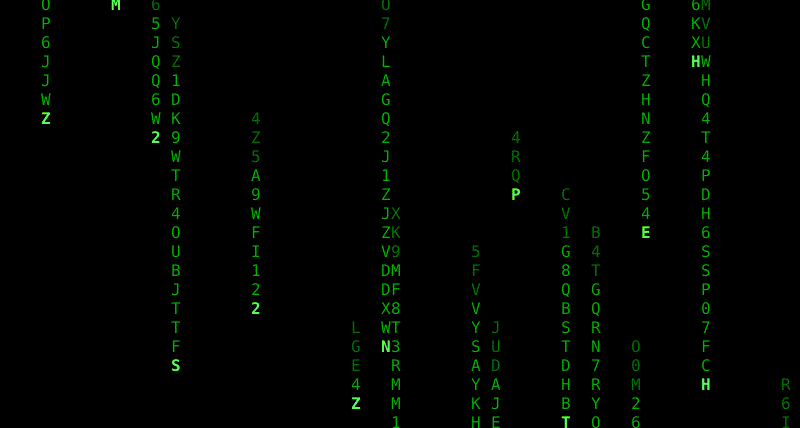

# digital-rain
Animation of colored falling symbols (also known as Matrix digital rain) for Linux terminal.

<center>
 
</center>

## Building
```
$ # inside the project root:
$ mkdir build
$ cd build
$ cmake ..
$ make matrix-rain
```

## Usage

For default green symbols:
```
$ ./matrix-rain
```

To change color of symbols (ex. blue) use:
```
$ ./matrix-rain blue
```

Supported colors:
- black
- red
- green
- yellow
- blue
- magenta
- cyan
- lightgreen
- lightyellow
- lightblue
- lightmagenta
- lightcyan
- white

You can list more than one color then there will be rain drops of different colors:
```
$ ./matrix-rain green magenta
```


